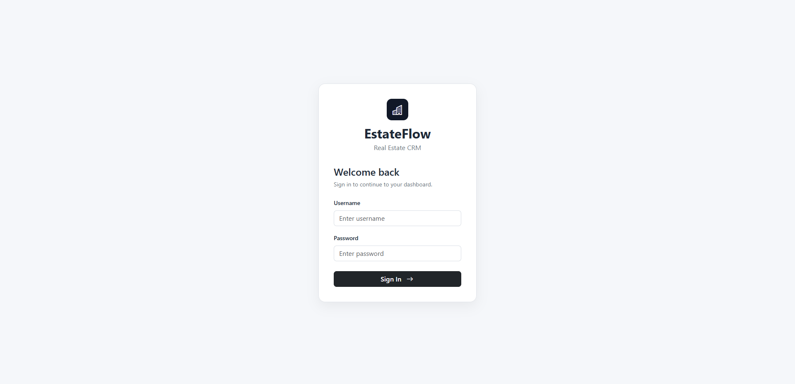
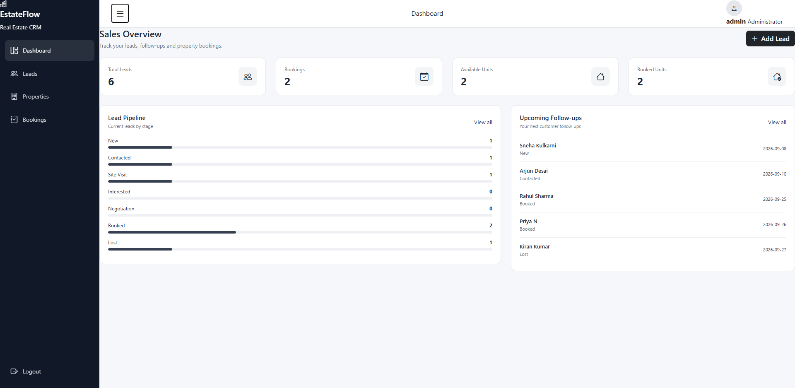
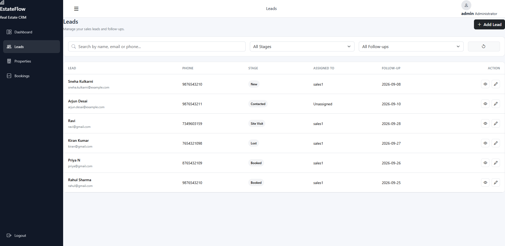
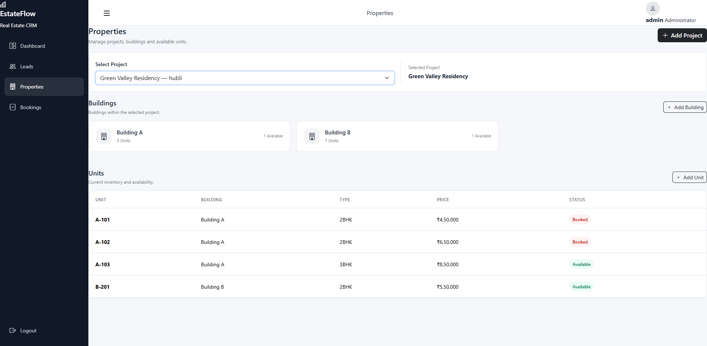
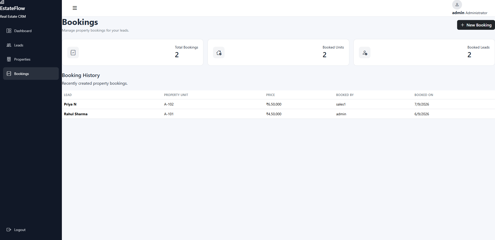

# EstateFlow - Real Estate CRM

EstateFlow is a small Real Estate CRM application designed for sales teams to manage leads, property inventory, and property bookings from a single platform.

The application provides role-based access for Admins and Sales Employees, lead tracking, property management, booking workflows, and a sales dashboard.

---

## Features

### Lead Management

- Create and edit leads
- Search leads by name, email, or phone
- View lead details
- Track lead stages:
  - New
  - Contacted
  - Site Visit
  - Interested
  - Negotiation
  - Booked
  - Lost
- Assign leads to Sales Employees
- Add notes and follow-up dates
- Sales Employees can only access their assigned leads

### Property Management

The property structure follows:

**Project → Building → Unit**

Each unit contains:

- Unit number
- Unit type
- Price
- Availability status

Admins can create and manage projects, buildings, and units.

Sales Employees can view available property information.

### Booking Management

The booking flow connects:

**Lead → Project → Building → Unit**

The system:

- Allows a lead to be connected to a property unit
- Prevents a unit from being booked twice
- Updates the unit status after booking
- Automatically moves the lead to the Booked stage
- Records who created the booking and when

### Dashboard

The dashboard provides an overview of:

- Total leads
- Total bookings
- Available units
- Booked units
- Lead pipeline by stage
- Upcoming follow-ups

Dashboard information is also filtered according to the logged-in user's role.

### Authentication & Permissions

Two application roles are supported:

**Admin**

- Manage projects
- Manage buildings
- Manage units
- Manage leads
- View bookings
- Access overall CRM information

**Sales Employee**

- View and manage assigned leads
- Add follow-ups and notes
- View property inventory
- Create bookings for assigned leads
- View their own bookings

---

## Technology Stack

### Backend

- Python
- Django
- Django REST Framework
- Django ORM

### Frontend

- HTML5
- CSS3
- Bootstrap 5
- JavaScript
- Bootstrap Icons

### Database

- SQLite

### Authentication

- Django Authentication
- Session Authentication
- Role-based permissions

### Development Tools

- VS Code
- Git
- GitHub

---

## Project Structure

```text
RealEstateCRM/
│
├── accounts/
│   ├── models.py
│   ├── permissions.py
│   ├── urls.py
│   └── views.py
│
├── crm/
│   ├── models.py
│   ├── serializers.py
│   ├── urls.py
│   └── views.py
│
├── properties/
│   ├── models.py
│   ├── serializers.py
│   ├── urls.py
│   └── views.py
│
├── config/
│   ├── settings.py
│   ├── urls.py
│   └── views.py
│
├── templates/
│   ├── base.html
│   ├── login.html
│   ├── dashboard.html
│   ├── leads.html
│   ├── properties.html
│   └── bookings.html
│
├── static/
│   ├── css/
│   │   └── style.css
│   │
│   └── js/
│       ├── app.js
│       ├── dashboard.js
│       ├── leads.js
│       ├── properties.js
│       └── bookings.js
│
├── screenshots/
│   ├── Login.png
│   ├── DashBoard.png
│   ├── Leads.png
│   ├── Properties.png
│   └── Bookings.png
│
├── manage.py
├── requirements.txt
├── .gitignore
└── README.md
```

---

## Screenshots

### Login



### Dashboard



### Lead Management



### Property Management



### Booking Management



---

## API Overview

| Method | Endpoint | Purpose |
|---|---|---|
| GET | `/api/leads/` | List leads |
| POST | `/api/leads/` | Create a lead |
| PUT/PATCH | `/api/leads/{id}/` | Update a lead |
| GET | `/api/projects/` | List projects |
| GET | `/api/buildings/` | List buildings |
| GET | `/api/units/` | List property units |
| GET | `/api/bookings/` | View bookings |
| POST | `/api/bookings/` | Create a booking |
| GET | `/api/dashboard/` | Dashboard statistics |
| GET | `/api/me/` | Current logged-in user |

---

## Important Technical Decisions

### 1. Role-Based Access Control

Admin and Sales Employee permissions are handled on the backend rather than relying only on the frontend.

Sales Employees can only access their assigned leads and create bookings for those leads.

### 2. Property Hierarchy

Properties are structured as:

**Project → Building → Unit**

This keeps the property relationships simple and makes it easier to manage inventory.

### 3. Duplicate Booking Protection

Each unit can have only one booking using a database-level `OneToOneField`.

Booking creation also uses a database transaction and row locking to prevent two users from booking the same unit at the same time.

### 4. Server-Side Validation

Important business rules such as phone number validation, unit availability, lead assignment, and booking permissions are validated on the backend.

### 5. Booking History

Bookings are preserved as records instead of simply deleting booking information when property status changes.

This keeps a useful booking history for the sales team.

---

## Database Overview

The main relationships are:

- User → Lead
- Project → Building
- Building → Unit
- Lead → Booking
- Unit → Booking
- User → Booking

The application uses SQLite for the project database.

---

## Setup

### 1. Clone the repository

```bash
git clone https://github.com/Kishan-su/real-estate-crm.git
cd real-estate-crm
```

### 2. Create a virtual environment

Windows:

```bash
python -m venv .venv
```

### 3. Activate the virtual environment

Windows PowerShell:

```powershell
.venv\Scripts\activate
```

### 4. Install dependencies

```bash
pip install -r requirements.txt
```

### 5. Apply migrations

```bash
python manage.py migrate
```

### 6. Create an admin user

```bash
python manage.py createsuperuser
```

### 7. Start the development server

```bash
python manage.py runserver
```

Open the application in your browser at:

```text
http://127.0.0.1:8000/accounts/login/
```

---

## Validation & Edge Cases

The application handles several important edge cases:

- Invalid phone numbers are rejected.
- Property prices must be greater than zero.
- Sales Employees cannot access other employees' leads.
- Sales Employees cannot assign leads to other employees.
- Sales Employees can only book their assigned leads.
- Already-booked units cannot be booked again.
- Database constraints protect against duplicate unit bookings.
- Unauthenticated users cannot access CRM pages or APIs.
- Admin-only property management actions are protected by backend permissions.

---

## Demo Flow

1. Login as Admin or Sales Employee.
2. View the sales dashboard.
3. Create or manage leads.
4. Track lead stages and follow-ups.
5. Browse projects, buildings, and units.
6. Create a booking for an assigned lead.
7. Verify that the unit becomes Booked and the lead moves to the Booked stage.

---

## Future Improvements

- PostgreSQL for production deployment
- Advanced reporting and sales analytics
- Email/SMS follow-up reminders
- Lead activity history
- Pagination for larger datasets
- Production deployment with HTTPS

---

## Author

**Kishan Uppar**

Python Full Stack Developer
---

## Deployment

The project includes a `render.yaml` Blueprint and `build.sh` for Render deployment.

Required deployment secrets:

- `DEMO_ADMIN_PASSWORD`
- `DEMO_SALES_PASSWORD`

The build runs migrations, collects static files, and creates the demo users/sample CRM data. The production database is PostgreSQL through `DATABASE_URL`.
